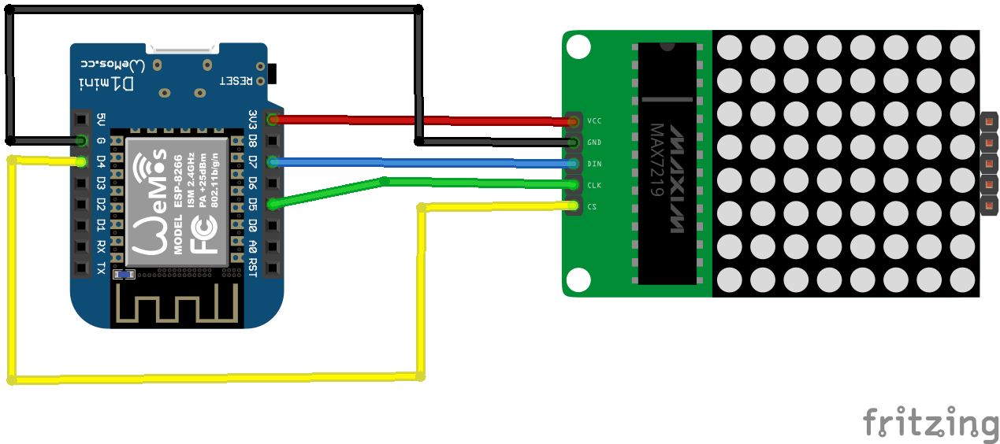

# World Clock LED Matrix Display

WorldClock is a world clock display for MAX7219 or MAX7221 LED matrix display controllers using Arduino. It was built using D1 Mini Pro and 2 MAX7219 32x8 units connected together, however it can easily be adjusted to other controllers, other displays in other sizes.

<center></center>

## Functionality

### World Clock

WorldClock will rotate between multiple timezones (configurable) and will display the time in each. It uses an NTP service to get the accurate time, including Daylight Saving offset if applicable. It will refresh the results every 24 hours.

### MQTT Support

There is also (optional) support for MQTT for receiving messages which will then be displayed once in higher brightness to atract attention.

## Hardware and Assembly

Please refer to any of the many tutorials that are available to assemble your setup based on the components you chose.

<center></center>

## Configuration

For configuration edit the sketch prior to uploading it to your controller.

### Timezone

To configure the list of timezones to be displayed, you will need to fill two arrays respectively `timezones[]` and `timezonesLabels[]`.

In the following example the clock will rotate between London and Kenya. The first member of the `timezones[]` array is the timezone label in London, and the first member in the `timezonesLabel[]` array is the label to be display in the clock. It doesn't need to match the timezone, as can be seen in the second member which is set to `Kenya`. 

For the valid list of timezones see http://worldtimeapi.org/api/timezone. 

```c++
char* timezones[] =      { "Europe/London", "Africa/Nairobi" };
char* timezoneLabels[] = { "London",        "Kenya" };
```

### Wifi

The following configuration parameters are defined in `secrets.h`.

* `SECRET_SSID` - the name of your WiFi SSID.
* `SECRET_PASS` - the passowrd for you WiFi.

### Other

* `MQTT_HOSTNAME` - the hostname of your MQTT server. This parameter is defined in `secrets.h`.
* `deviceName` - the hostname for the device. This is also used as the prefix for the MQTT topic if used.
* `HARDWARE_TYPE` - the type of MAX7219 unit you are using. Default `MD_MAX72XX::FC16_HW`
* `MAX_DEVICES` - the number of 8x8 devices that will be in use.
* `CS_PIN`, `CLK_PIN`, `DATA_PIN` - the SPI pins used by the controller. **Note** that if using hardware SPI you will only need to set the `CD_PIN`.
* `INTENSITY_NORM` - the display intensity for normal use (clock view).
* `INTENSITY_ALERT` - the display intensity for alerts (MQTT).

## Credits

* WorldClock uses the wonderful MD_Parola library https://github.com/MajicDesigns/MD_Parola, 
* For free timezone data: http://worldtimeapi.org 
